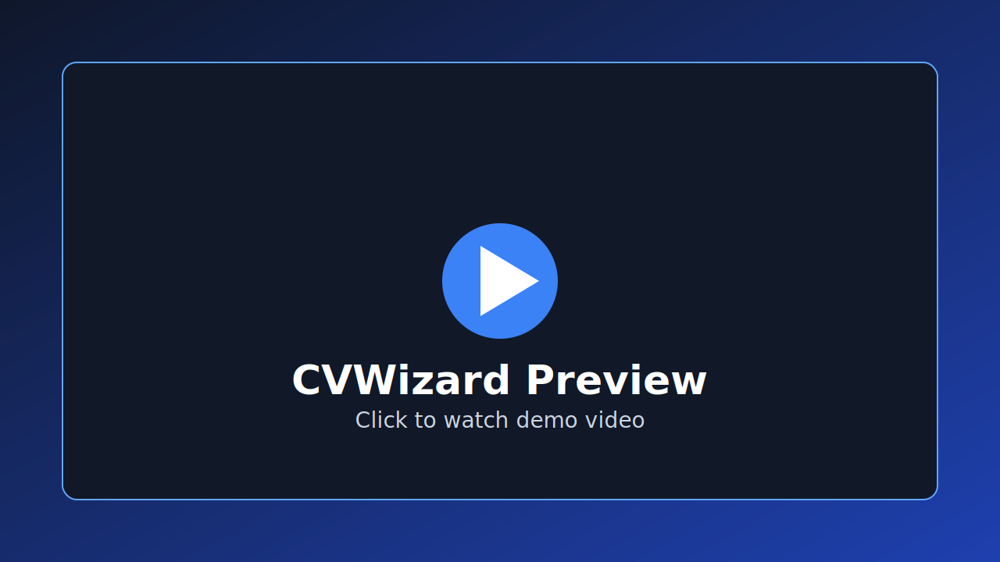

# 🚀 CVWizard: AI-Powered Intelligent Resume Builder

[](https://opensource.org/licenses/MIT)
[](https://react.dev/)
[](https://vitejs.dev/)
[](https://www.typescriptlang.org/)
[](https://ai.google.dev/)

CVWizard is a state-of-the-art, AI-driven resume building platform designed to help professionals create high-impact, ATS-friendly CVs in minutes. Leveraging Google's Gemini AI, it streamlines the writing process and provides intelligent content suggestions.

[**✨ Explore the Live Demo**](https://rose1996iv.github.io/cvwizard/)

---

## 📸 Preview

[](./preview.mp4)

*Click the image above to view the platform in action.*

---

## 🌟 Key Features

### 🤖 Intelligent AI Assistance (via Google Gemini)
- **Automatic Resume Parsing:** Import your raw content and let AI structure it perfectly.
- **Smart Summaries:** Generate compelling professional summaries tailored to your role.
- **Experience Enhancement:** Transform basic bullet points into achievement-oriented descriptions.
- **Skill Suggestions:** Get personalized skill recommendations based on your experience.

### 🛠️ Powerful Builder Infrastructure
- **Guided multi-step workflow** that covers Personal Info, Experience, Education, and Skills.
- **Real-time Live Preview:** Watch your resume take shape instantly as you type.
- **Dynamic Custom Sections:** Add unique sections to showcase your specific achievements.

### 🎨 Design & Export
- **Aesthetic Customization:** Fine-tune colors, backgrounds, and typography.
- **ATS-Optimized Templates:** Ensuring your resume passes through screening filters.
- **One-Click PDF Export:** Download high-quality, print-ready documents instantly.

---

## 💻 Tech Stack

- **Core:** [React 19](https://react.dev/) & [TypeScript](https://www.typescriptlang.org/)
- **Build Tool:** [Vite 6](https://vitejs.dev/)
- **AI Engine:** [Google Gemini API](https://ai.google.dev/)
- **Icons:** [Lucide React](https://lucide.dev/)
- **Styling:** Modern Vanilla CSS with CSS Modules/Variables

---

## 🚀 Getting Started

### Prerequisites
- **Node.js** (v20 or higher)
- **npm** or **yarn**
- A **Gemini API Key** (Get one at [Google AI Studio](https://aistudio.google.com/))

### Installation

1. **Clone the repository:**
   ```bash
   git clone https://github.com/rose1996iv/cvwizard.git
   cd cvwizard
   ```

2. **Install dependencies:**
   ```bash
   npm install
   ```

3. **Environment Configuration:**
   Create a `.env.local` file in the root directory:
   ```env
   GEMINI_API_KEY=your_gemini_api_key_here
   ```

4. **Launch Development Server:**
   ```bash
   npm run dev
   ```
   Access the app at `http://localhost:3000`

---

## 📁 Project Architecture

```text
├── components/       # Reusable UI components & Resume templates
├── services/         # Gemini AI integration logic
├── hooks/            # Custom React hooks (Debouncing, State Management)
├── types.ts          # Centralized TypeScript definitions
├── App.tsx           # Main application shell and wizard flow
└── vite.config.ts    # Build and environment configuration
```

---

## 🛡️ Security & Best Practices

- **API Security:** Currently, the Gemini API is called directly from the client. For enterprise production, it is recommended to route these requests through a secure backend proxy to protect your API keys.
- **Privacy:** Data is processed in real-time and remains in the client-side state during the session.

---

## 📄 License

This project is licensed under the MIT License - see the [LICENSE](LICENSE) file for details.

---

<p align="center">Made with ❤️ for professionals worldwide.</p>

